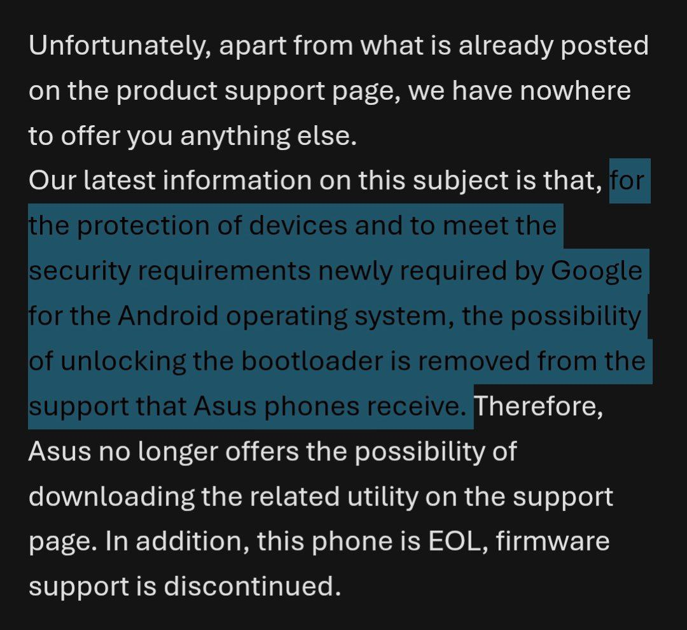

<h1>companies who's morals have turned sour<h1>

| Company | immoral thing | proof |
|---------|---------------|-------|
| Samsung | Stopped allowing bootloader unlocking and supports taking away your freedoms | https://xdaforums.com/t/bootloader-unlocking-option-removed-from-one-ui-8-0.4751904/ |
| Asus    | Stopped allowing bootloader unlocking and supports taking away your freedoms, anti repair, not to mention making stuff with bad software with lots of vulnerabilities |  |
| Collective shout | Censoring the internet, debanking and are taking away your freedoms | [self incrimination lmao](https://www.collectiveshout.org/) |
| Blackrock |
| Visa |
| Mastercard |
| Nestlé |
| Apple |
| Activision/Blizzard |
